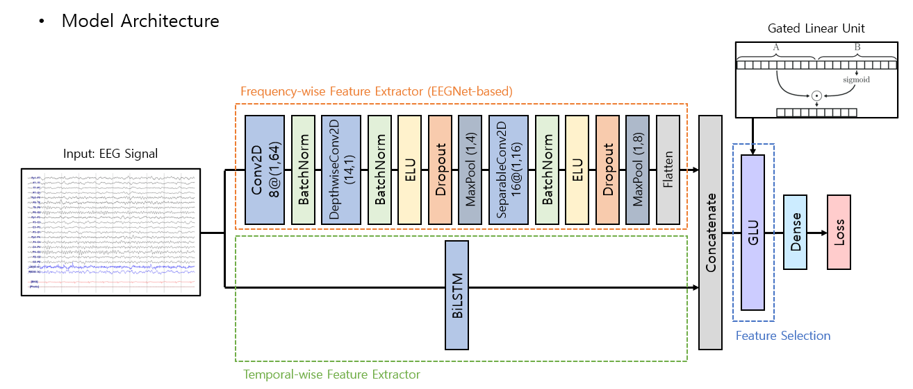

# neuromarketing_cnn-bilstm
User preference classification using cnn-bilstm (Tensorflow implementation code)

Dataset: Product Choice Dataset
Yadava, M., Kumar, P., Saini, R. et al. Analysis of EEG signals and its application to neuromarketing. Multimed Tools Appl 76, 19087–19111 (2017). https://doi.org/10.1007/s11042-017-4580-6

Model architecture:

